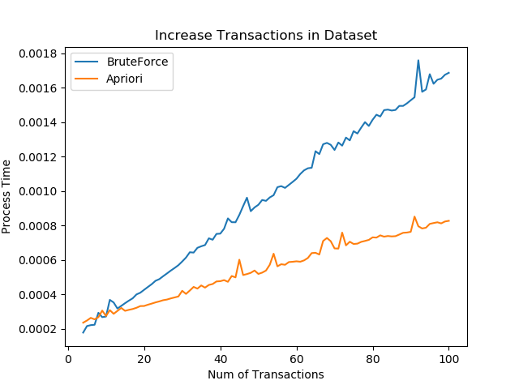

# pa04-Spring2020
 Python implementation of Association Rule Mining: a trivial (brute force) solution and Apriori Algorithm to find frequent itemsets 

## Association Rule Mining
• developed to analyze market basket data 

• identified groups of market items that customers tended to buy in association with each other 

• People who buy soap and shampoo have an increased probability of buying hairspray 

## Code
[brute_force.py](brute_force.py):a brute_force implementation to find frequent itemsets  
[apriori.py](apriori.py): use Apriori algorithm to find frequent itemsets  
[test.py](test.py): compare and analyse performances of two solutions 

## Results

  

 
